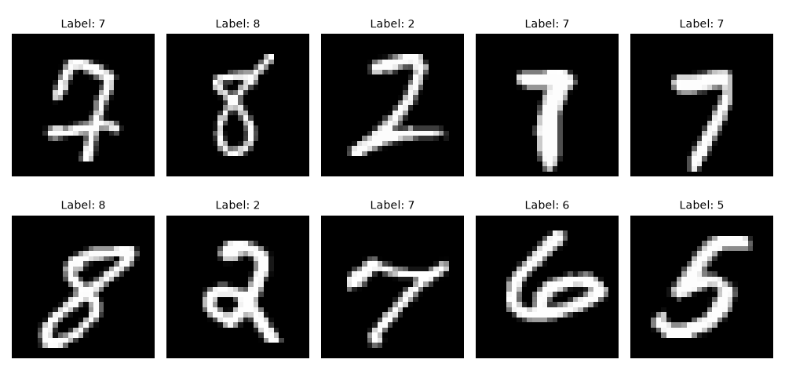

# 扩散模型

本章在扩散模型的nano手搓版本基础上，追加一个Classifier-Free Guidance（CFG）
用于在扩散模型生成时候增加指引信息，引导模型生成符合要求的图像。

# 环境依赖
```shell
conda create -n py312DDPM python=3.12
conda activate py312DDPM
pip install -r requirements.txt
```

# 项目结构
- ddpm.py：用于给定原始图片，时间t计算加噪后的图片。同时也用于从随机噪声出发进行图片生成
- model.py: 神经网络结构，同于给定原始图片和时间t，预测噪声eps
- train.py: 训练代码
- inference.py: 推理代码

```text
├── README.md
├── data
│   └── MNIST
└── diffusion_model
    ├── README.md
    ├── ckpt
    │   └── checkpoint_epoch_100.pth
    ├── ddpm.py
    ├── download_dataset.py
    ├── example
    │   └── mnist_visualize.png
    ├── inference.py
    ├── model.py
    └── train.py
```

# 运行效果

## 数据下载
使用python脚本可以下载MNIST手写数字识别数据集：
```shell
# cd diffusion_model
python download_dataset.py
```


## 模型训练
使用train.py可以使用MNIST手写数字数据集进行扩散模型训练。
```shell
python train.py
```
输出结果如下:
```text
Starting training on mps...
Epoch 000/30: 100%|█████████████████████████████████████████████████████████████████████████████████████████████████████████████████████| 118/118 [00:11<00:00,  9.84it/s, avg_loss=0.1844, loss=0.0340]
==> Epoch 000 Final Avg Loss: 0.184419
Epoch 001/30: 100%|█████████████████████████████████████████████████████████████████████████████████████████████████████████████████████| 118/118 [00:11<00:00, 10.34it/s, avg_loss=0.0286, loss=0.0227]
==> Epoch 001 Final Avg Loss: 0.028581
Epoch 002/30: 100%|█████████████████████████████████████████████████████████████████████████████████████████████████████████████████████| 118/118 [00:11<00:00, 10.21it/s, avg_loss=0.0203, loss=0.0240]
==> Epoch 002 Final Avg Loss: 0.020335
Epoch 003/30: 100%|█████████████████████████████████████████████████████████████████████████████████████████████████████████████████████| 118/118 [00:11<00:00, 10.30it/s, avg_loss=0.0170, loss=0.0137]
==> Epoch 003 Final Avg Loss: 0.016954
Epoch 004/30: 100%|█████████████████████████████████████████████████████████████████████████████████████████████████████████████████████| 118/118 [00:11<00:00, 10.22it/s, avg_loss=0.0164, loss=0.0257]
==> Epoch 004 Final Avg Loss: 0.016356
Epoch 005/30: 100%|█████████████████████████████████████████████████████████████████████████████████████████████████████████████████████| 118/118 [00:11<00:00, 10.26it/s, avg_loss=0.0147, loss=0.0139]
==> Epoch 005 Final Avg Loss: 0.014666
[SAVE] Checkpoint saved: ./ckpt/model_epoch_005.pth
```

## 模型推理
使用inference.py可以从随机噪声开始进行手写数字生成。
```shell
python inference.py
```
下面是训练了100个Epoch的扩散模型的效果：
- pred表示给定的控制条件是预测数字几，s表示引导系数
- 基本上s>=1的时候就可以完全生成需要的内容了


# 踩坑记录

### MPS对于nn.Embedding的越界问题不报错
模型训练效果有问题，最后查来查去发现是`pe_c = nn.Embedding(n_classes, pe_dim)`，n_classes传入了4。
但诡异的是，在`device="mps"`上运行的时候居然没报错！切换成device='cpu'的时候才发现有问题。

### 引导系数s的作用位置

```python
# 引导系数s应该作用在eps上而非x_t上，

# 正确示范
# [ddpm.py] 推理两次，控制条件分别用空值和目标值
eps_empty = net(x_t, t_tensor, c_tensor_empty)
eps_guidance = net(x_t, t_tensor, c_tensor)

s_tensor = torch.FloatTensor(s).to(device)
s_tensor = s_tensor.view(-1, 1, 1, 1)

eps = eps_empty + s_tensor * (eps_guidance - eps_empty)

# 错误示范
# [ddpm.py]
# 每次给定当前x，t进行一次降噪
# for t in tqdm(range(self.n_steps - 1, -1, -1), desc="Inference"):
#     x_empty = self.sample_backward_step(x, t=t, c=10, net=net, device=device, simple_var=simple_var)
#     x_guidance = self.sample_backward_step(x, t=t, c=c, net=net, device=device, simple_var=simple_var)
#     x = x_empty + s * (x_guidance - x_empty)
```

# 参考资料
1. [扩散模型详解](https://zhouyifan.net/2023/07/07/20230330-diffusion-model/)
