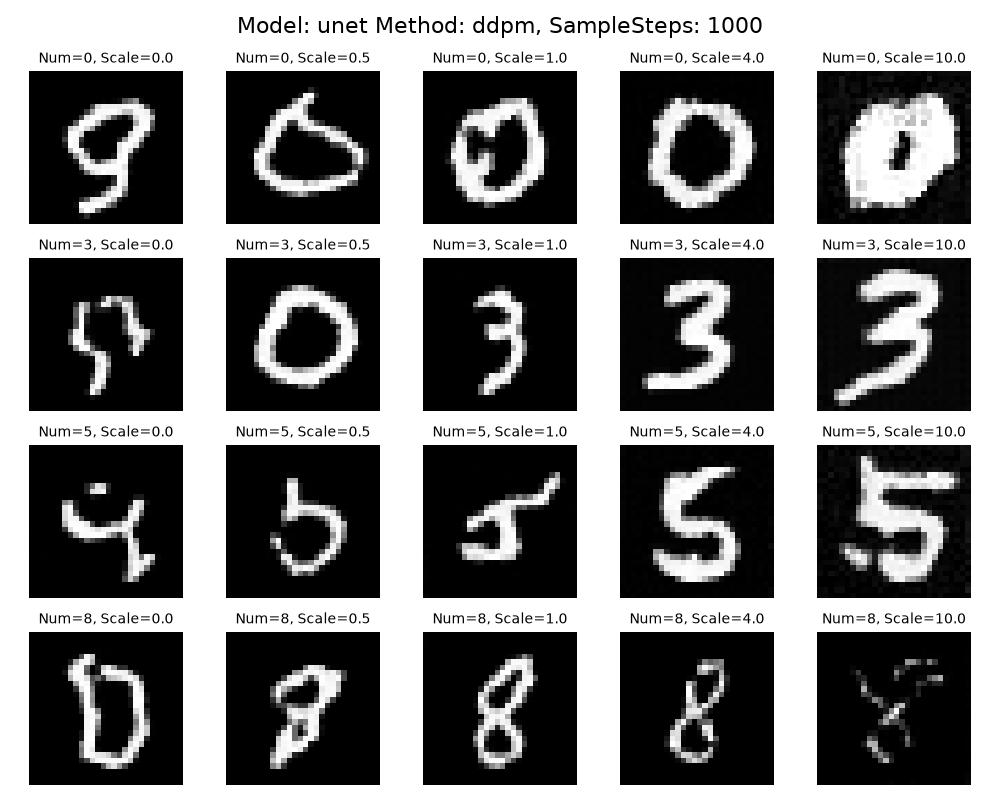
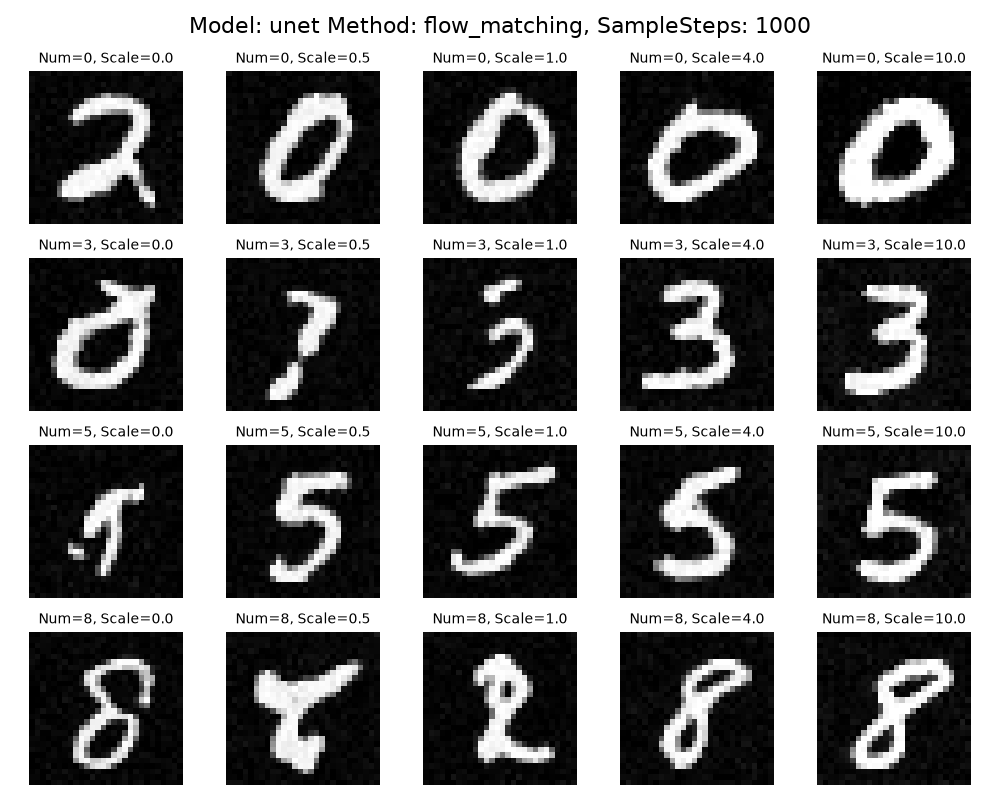
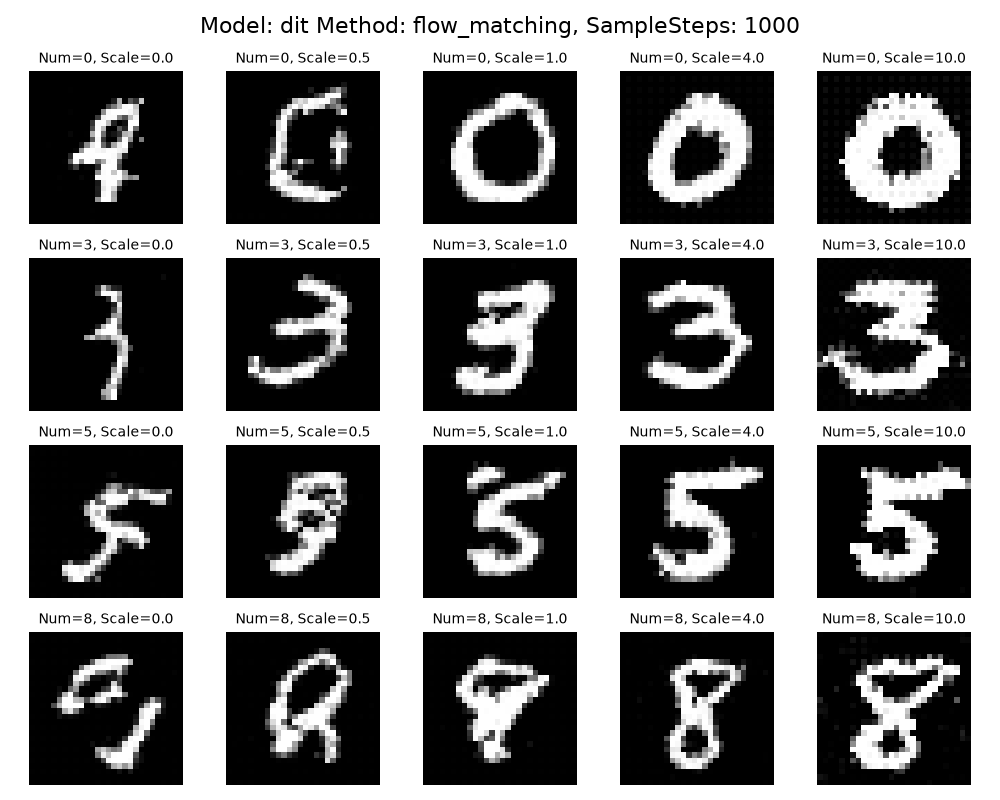

# Diffusion Model

本章主要用于搭建一个简易版本的训练框架：
- 在模型选型上，支持UNet，Diffusion Transformer模型
- 在训练方式上，支持DDPM和Flow Matching

模型上增加对于Diffusion Transformer的支持，但暂时不开启VAE，默认开启CFG

# 环境依赖
```shell
conda create -n py312DDPM python=3.12
conda activate py312DDPM
pip install -r requirements.txt
```

# 项目结构
预期项目结构如下：
```text
04_diffusion_transformer/
├── configs.py           # 核心：使用 Namespace 或字典存储所有超参数
├── main.py              # 入口：负责训练和推理的调度
├── core/
│   ├── __init__.py
│   ├── base_engine.py   # 定义采样和训练的抽象接口
│   ├── ddpm_engine.py   # 扩散模型逻辑
│   └── fm_engine.py     # 流匹配逻辑
├── models/
│   ├── __init__.py
│   ├── unet.py          # 经典的 U-Net
│   └── dit.py           # Diffusion Transformer
├── utils/
│   ├── data.py          # 数据加载
│   └── logger.py        # 进度条和可视化
└── runs/                # 训练记录
```

# 使用介绍

### 模型训练
```shell
# 使用DDPM + UNet
python main.py --mode train --method ddpm --model unet --lr 0.0002 --batch 128 --channels 64 128 256 512 --device mps

# 使用FlowMatching + UNet
python main.py --mode train --method flow_matching --n_steps 10 --model unet --lr 0.0002 --batch 128 --channels 64 128 256 512 --device mps

# 使用FlowMatching + DiT
python main.py --mode train --method flow_matching --n_steps 1000 --sample_steps 20 --model dit --lr 0.0002 --batch 128 --device mps
```
模型会输出训练进度，同时每5个epoch自动进行一次测试：
```text
[INFO] Experiment log will be saved to: ./runs/20260615_163626_unet_flow_matching
Epoch 1: 100%|████████████████████████████████████████████████████████████████████████████████████████████████████████████████████████████████████████████| 469/469 [01:18<00:00,  5.94it/s, loss=0.176]
Epoch 2: 100%|████████████████████████████████████████████████████████████████████████████████████████████████████████████████████████████████████████████████████████████████████| 469/469 [01:18<00:00,  5.99it/s, loss=0.186]
Epoch 3: 100%|████████████████████████████████████████████████████████████████████████████████████████████████████████████████████████████████████████████████████████████████████| 469/469 [01:18<00:00,  5.98it/s, loss=0.163]
Epoch 4: 100%|████████████████████████████████████████████████████████████████████████████████████████████████████████████████████████████████████████████████████████████████████| 469/469 [01:18<00:00,  5.94it/s, loss=0.167]
Epoch 5: 100%|████████████████████████████████████████████████████████████████████████████████████████████████████████████████████████████████████████████████████████████████████| 469/469 [01:18<00:00,  6.00it/s, loss=0.187]
FlowMatching Sampling: 100%|███████████████████████████████████████████████████████████████████████████████████████████████████████████████████████████████████████████████████████████████████| 10/10 [00:00<00:00, 165.88it/s]
```
模型信息保存结构如下:
- checkpoints: 模型参数
- config.json: 模型配置信息
- samples: 模型每5个epoch的测试结果
```text
├── runs
│     ├── 20260615_152425_unet_ddpm
│     └── 20260615_163626_unet_flow_matching
│         ├── checkpoints
│         │     └── last.pth
│         ├── config.json
│         ├── events.out.tfevents.1781512586.xxx
│         └── samples
│             ├── epoch_5.png
│             └── epoch_10.png
```

### 模型推理
通过指定训练记录文件夹，自动读入配置，并根据输入的测试数据进行推理。
- infer_mode=zip，需要infer_labels和infer_scales等长，对应位置为pair进行处理
- infer_mode=product，则将infer_labels和infer_scales排列组合进行对比
```shell
# python main.py --mode sample --infer_mode product --exp_dir runs/20260615_201406_dit_flow_matching/ --infer_labels 0 3 5 8 --infer_scales 0.0 0.5 1.0 4.0 10.0
python main.py --mode sample --infer_mode product --exp_dir runs/{model_name} --infer_labels 0 3 5 8 --infer_scales 0.0 0.5 1.0 4.0 10.0
```

# 结果展示
看起来感觉是【UNet + FM + sample_step=1000】最优，【DiT + FM + sample_step=50】次之啊。感觉DiT果然还是有点不好训的，或者说还得调调参数啥的。
而且可能因为训练量不太够，或者是加了引导的原因？scale=0的时候图片效果都比较差

### UNet + DDPM + sample_step=1000


### UNet + FM + sample_step=1000


### DiT + FM + sample_step=1000


### DiT + FM + sample_step=50


# 踩坑记录