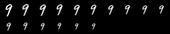
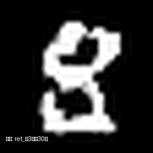

# Video Generation based on DiT
该项目主要用于进阶到视频生成领域：
- 构建视频：为对MNIST手写数据集进行缩放，翻转，旋转等操作来构成一个3-5秒的视频。
- 构建控制文本：搭配模板来生成对应的文本描述。考虑到token有限，直接按char切分，然后从零初始化一个embedding。

# 环境依赖
```shell
conda create -n py312DDPM python=3.12
conda activate py312DDPM
pip install -r requirements.txt
```

# 使用介绍

### 数据构建
使用video_generator可以根据给定的图片&指令生成对应的视频，提供了两种可视化方式：
- 输出成.mp4格式的视频
- 输出成.png格式的胶片序列图
```python
python video_generator.py
```
生成的胶片序列图样例如下：
- (上图) 将9水平翻转
- (下图) 将9缩小2倍

<p align="center">
  
</p>
<p align="center">
  
</p>

### 模型训练
```shell
# [Demo-01] 使用FlowMatching + DiT，n_frames=6测试版本，指令内容被限制在“翻转”上
python main.py --mode train --method flow_matching --n_steps 1000 --num_frames 6 --sample_steps 50 --model dit --lr 0.0002 --batch 16 --patch_size 2 --device mps

# [Demo-02] 使用FlowMatching + DiT，n_frames=16，指令内容不做约束
python main.py --mode train --method flow_matching --n_steps 1000 --num_frames 16 --sample_steps 50 --model dit --lr 0.0002 --batch 32 --patch_size 2 --device cude
```

### 模型推理
```shell
python main.py --mode sample --sample_steps 100 --device cuda --exp_dir ./runs/{model_name}
```

# 输出效果

### Demo-01
使用FlowMatching + DiT，n_frames=6测试版本，指令内容被限制在“垂直翻转”上。
device=mps上，平均个一个epoch要训27分钟，Epoch=10的效果还能看：


### Demo-02
使用FlowMatching + DiT，n_frames=16，指令内容不做限制。device=h20，平均一个epoch要训10分钟。





# 踩坑记录

### 颜色风格不一致
- 问题：生成出来的视频里，旋转类型是白底黑字，其他类型是黑底白字
- 原因：查了一下可能是dataloader在生成旋转图片的时候填充颜色不正确
```shell
python main.py --mode train --method flow_matching --n_steps 1000 --num_frames 6 --sample_steps 50 --model dit --lr 0.0002 --batch 32 --patch_size 2 --device mps
```
Epoch=30的结果如下：


### 训练不稳定 & 颗粒感明显
- 现象：推理结果大部份都是纯黑或者纯白的色块。
- 原因：查了一下主要是真实图片x_real和采样噪声eps的分布不一致，x_real是[-1, 1]
分布，eps是N(0, 1)分布，导致eps的实际方差反而更大，导致模型学习困难，前期很难将最终结果收敛到[-1, 1]分布上。
同时可视化代码的分布假设也没有对齐。
- 解决：把x_real，eps和可视化工具都约束在N(0, 1)上进行处理

### Loss下降慢
分析了一下可能是因为condition向量计算的时候为`cond = t_vec + c_vec`，其中`c_vec`来自一个随机初始化的GRU模块。
他可能训练初期不太稳定，导致还会掩盖`t_vec`的信号。

尝试方案是考虑到指令本身很短，结构化也很强，考虑换一个简单的编码器。claude老师推荐了一个结构，不过我感觉这个会导致模型傻傻分不清【将x放大n倍】里面的x和n。
```python
class InstructionEncoder(nn.Module):
    def __init__(self, vocab_size, embed_dim, hidden_dim):
        super().__init__()
        self.embedding = nn.Embedding(vocab_size, embed_dim)
        self.fc = nn.Linear(embed_dim, hidden_dim)
    
    def forward(self, x):
        # x: [B, L]
        mask = (x != 0).float().unsqueeze(-1)  # 排除 PAD
        emb = self.embedding(x)  # [B, L, E]
        pooled = (emb * mask).sum(dim=1) / mask.sum(dim=1).clamp(min=1)  # [B, E]
        return self.fc(pooled)  # [B, D]
```

