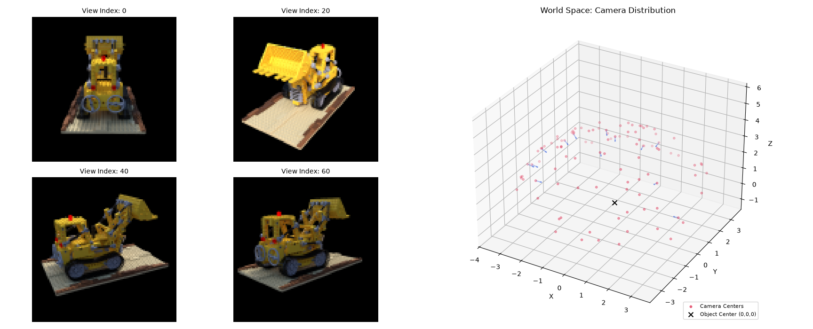
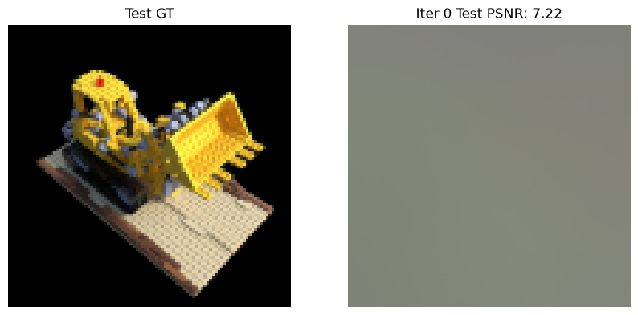
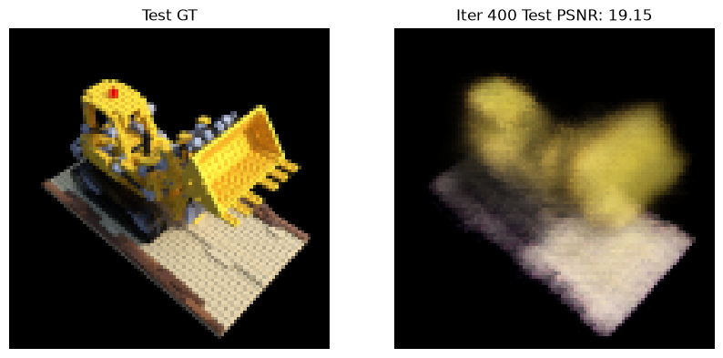
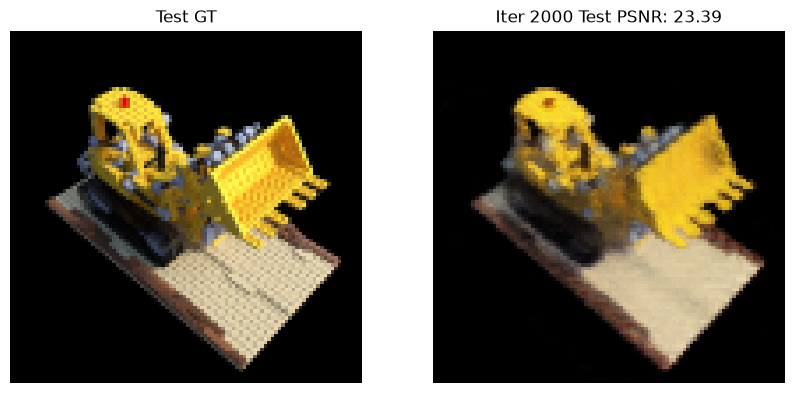

# NeRF

本章主要用于记录NeRF的nano手搓版本，用于对NeRF有一个基本的认识。

# 环境依赖
```shell
conda create -n py312threeD python=3.12
conda activate py312threeD
pip install -r requirements.txt
```

# 使用介绍

###  数据下载
```shell
wget http://cseweb.ucsd.edu/~viscomp/projects/LF/papers/ECCV20/nerf/tiny_nerf_data.npz
# 备份链接
# https://github.com/houchenst/FastNeRF/blob/master/tiny_nerf_data.npz.1
```
数据下载后放在公共文件夹`data`下面，可以使用dataloader.py进行可视化：
```shell
python dataloader.py
```
- 左边4张图表示了4个视角下的真实结果
- 右边散点图表示了106个摄像点


### 模型训练
- 使用mps进行训练，n_samples=64，iter=3000的时间消耗大概是30分钟
- 使用h20进行训练，n_samples=128，iter=10000的时间消耗大概是80分钟
```shell
# MPS训练命令
python train.py --data_path ../data/tiny_nerf_data.npz --exp_dir ./runs --device mps

# H20训练命令
python train.py --data_path ../data/tiny_nerf_data.npz --exp_dir ./runs/h20_demo --device cuda --n_iters 10000 --n_samples 128
```
训练过程中使用PSNR作为衡量指标，MPS环境iter=3000的情况下，PSNR=24.61，属于整体轮廓、颜色、大体形状清晰，但距离优秀还有第一定距离：






### 推理结果

# 踩坑记录

### 模型难以突破PSNR=26
- 现象：模型在iter=1400的时候PSNR达到了24，直到但iter=4000一直在24-25.9之间横跳
- 原因：
  - 部分原因是LR过高，同时也因为没有加任何的训练Trick（比如各类正则化）
  - 加了正则化又跑了一次还是不对，细看的话主要问题出在没有积木的颗粒感
- 解决方案：


# 参考资料
1. [NeRF: Neural Radiance Fields](https://github.com/bmild/nerf)