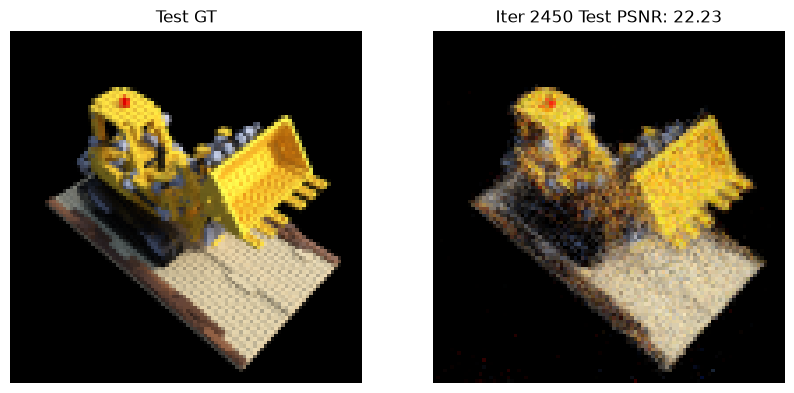

# Instant-NGP

本章主要用于记录Instant-NGP的nano手搓版本，用于对Instant-NGP有一个基本的认识。

# 环境依赖
```shell
conda create -n py312threeD python=3.12
conda activate py312threeD
pip install -r requirements.txt
```

# 使用介绍

### 数据下载
复用NeRF的训练集，放在公共路径下的`tiny_nerf_data.npz`。

### 模型训练
使用mps进行训练:
- n_samples=64，iter=2000的时间消耗大概是10分钟
- n_samples=192，iter=10000的时间消耗大概是2.8小时
```shell
python train.py --data_path ../data/tiny_nerf_data.npz --exp_dir ./runs/01 --n_samples 64 --n_iters 2000 --device mps
```

### 模型推理
使用推理代码可以生成和golden answer的对比图，以及多视角的gif动图：
```shell
python inference.py --data_path ../data/tiny_nerf_data.npz --exp_dir ./runs/01 --device mps
```


# 踩坑记录

### 验证集pnsr无法突破25
- 现象：在iter=600的时候验证集psnr达到了24.05，但iter=4000的时候，psnr=24.82，始终无法进一步突破。
- 原因：原因有很多可能性
  - 数据维度：包围盒的设置不合理，沿光线采样时候的near/far设置范围过大导致非场景采样较多，或者设置范围过小导致部分场景未被采样。
  - 训练维度：学习率过大导致哈希表单元格被反复争抢，细节无法被进一步优化。或者学习率过低导致优化停滞。模型可能出现“取巧”的方案，比如出现“浮片”来实现对特定光路的拟合。
  - 模型维度：network本身的超参数（诸如level_dim，L_dir等）可能不太够用
- 分析方法：分析的核心是进行多维度的数据分析和统计，主要包括：
  - 数据维度：先估算物体相对于镜头的near/far，然后统计光路上采样点的(x, y, z)坐标来进行合适的归一化。
  - 评测维度：除了PSNR指标外，还追加了SSIM指标来衡量结构学习情况，追加Max Pixel Error来衡量是否有闪烁的噪声点，追加误差热力图来可视化未拟合的区域。
- 解决方案：最终根据分析指标（PSNR完全停滞，SSIM增长极度缓慢，Max Error始终在 0.67-0.68 徘徊，顽固噪点纹丝不动）推断出问题主要来自离群点和学习率。
最终引入了稀疏性正则化、针对sigma的TV-loss、对哈希表的参数施加L2正则化来加以缓解。

### 验证集psnr卡在22.5无法继续提升
- 现象：大概在iter=600的时候就提升到psnr=22了，但iter=2400的时候psnr也还在22.4-22.6徘徊。
渲染出来的结果呈现出严重的“颗粒感”或“噪点感”。虽然挖掘机的形状和颜色都对，但它看起来不像一个实心的物体，而像是一堆发光的“沙子”或者碎屑。
- claude老师给出的原因如下：
  - 缺乏训练扰动：这是最可能的原因。在训练时，如果每条射线上的采样点位置是固定的（比如总是等间距的 64 个点），模型会学会一种“作弊”方式：它只在那些固定的点上填入颜色，而点与点之间的空间是空的。
  - 哈希冲突：哈希表设置得太小，不同的空间点会共用同一个特征。导致空间中莫名其妙地出现一些亮斑或暗点，也就是图里的细碎杂色。



改进方案为训练时候追加随机扰动：
```python
def render_rays(model, rays_o, rays_d, near, far, n_samples):
    # 1. 生成标准的等间距采样点 t_vals
    t_vals = torch.linspace(0., 1., steps=n_samples).to(rays_o.device)
    z_vals = near * (1.-t_vals) + far * t_vals
    z_vals = z_vals.expand(rays_o.shape[:-1] + (n_samples,))

    # --- 关键修改：增加随机扰动 (只在训练模式开启) ---
    if model.training:
        # 获取采样点之间的间距
        mids = .5 * (z_vals[...,1:] + z_vals[...,:-1])
        upper = torch.cat([mids, z_vals[...,-1:]], -1)
        lower = torch.cat([z_vals[...,:1], mids], -1)
        # 在区间内随机抖动
        t_rand = torch.rand(z_vals.shape).to(rays_o.device)
        z_vals = lower + (upper - lower) * t_rand
    # ----------------------------------------------

    # 剩下的逻辑不变...
    pts = rays_o[..., None, :] + rays_d[..., None, :] * z_vals[..., :, None]
    # ... 进行模型查询和体渲染积分 ...
```

### 验证集psnr=9.39并不随iter变化

- 现象：模型在iter=0的时候会输出全黑的图片，psnr=9.39，但进行1000次迭代后（以及迭代过程中）模型都会输出全黑的图片，psnr维持9.39不变。
- 原因：可能和模型初始化有关，初始参数过于接近0导致很容易输出全黑。而同时正确答案为黑色背景，导致陷入局部最优解。

改进方案为，增加哈希表初始值：
```python
# 稍微加大初始化范围，确保初期有梯度
for emb in self.embeddings:
    # nn.init.uniform_(emb.weight, a=-0.0001, b=0.0001)  
    nn.init.uniform_(emb.weight, a=-0.01, b=0.01)  # 从 0.0001 提升到 0.01
```