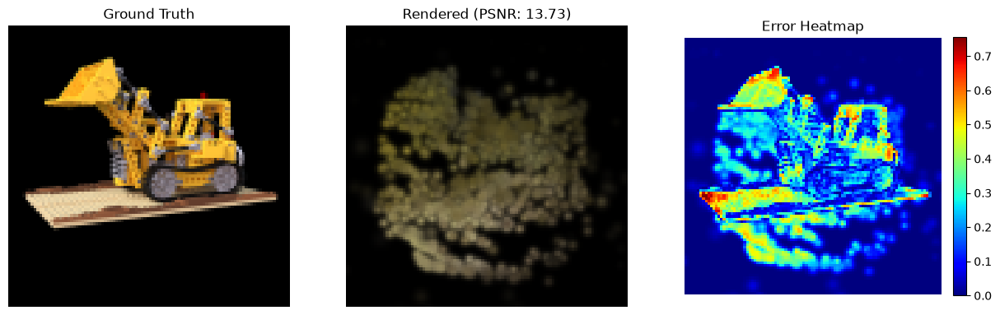
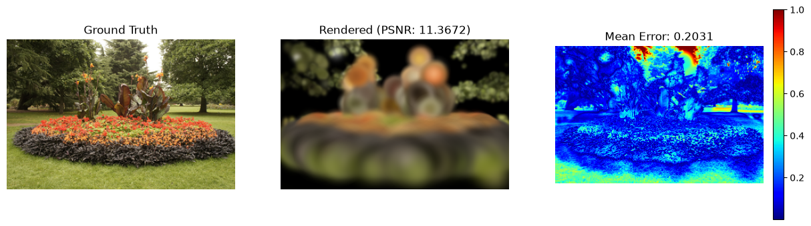
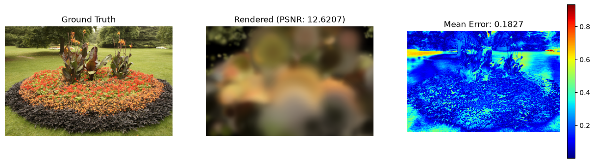
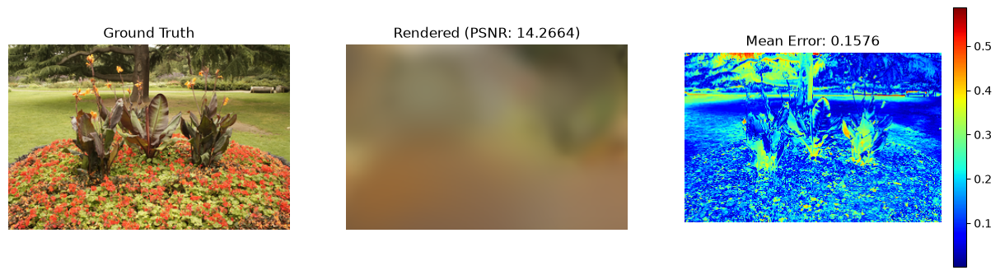
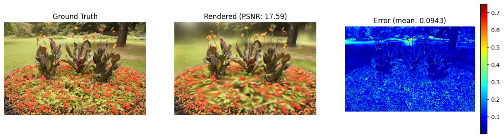
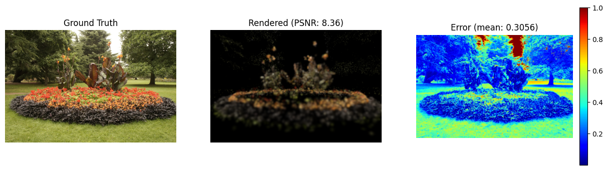

# 3D Gaussian Splatting

本章主要用于记录3DGS的nano手搓版本，用于对3DGS有一个基本的认识。

# 环境依赖
```shell
conda create -n py312threeD python=3.12
conda activate py312threeD
pip install -r requirements.txt
```

# 使用介绍

### 数据下载
- 复用NeRF的训练集，放在公共路径下的`tiny_nerf_data.npz`。但发现从零训练特别难。
- 下载`360_extra_scenes`数据集，放在公共路径下，包含`flowers`和`treehill`两个场景。
```shell
cd ../data && mkdir 360_extra_scenes
cd 360_extra_scenes
wget https://storage.googleapis.com/gresearch/refraw360/360_extra_scenes.zip
unzip 360_extra_scenes.zip

# python直接解压
# python -m zipfile -e 360_extra_scenes.zip ./
```

### 模型训练
使用H20进行进行训练，
```shell
# bash脚本
bash train_h20.sh

# python命令
DATA_PATH="../data/360_extra_scenes/flowers"
EXP_DIR="./runs/h20_v4"

python train.py \
    --data_path $DATA_PATH \
    --exp_dir $EXP_DIR \
    --factor 4 \
    --num_points 50000 \
    --n_iters 30000 \
    --sh_degree 3 \
    --tile_size 64 \
    --grad_threshold 0.0005 \
    --display_int 250 \
    --device cuda
```

### 模型推理

# 踩坑记录

### 推理结果是一团光晕
- 现象：模型输出的结果是好几团非常大的光晕，没有任何形状或轮廓
- 原因：发现是椭球初始化的太大了
- 解决方案：缩小椭球初始化时候的大小

### 推理结果无轮廓
- 现象：有大致的形状但没有清晰的轮廓
- 原因：初步怀疑是Nano版本中没有加椭球数量的自适应，然后point=3000 + 椭球初始化的比较小导致不太够用。
- 解决方案：暂未解决



### 椭球迅速变大
- 现象：从训练开始，椭球就快速变大导致图像轮廓逐渐不清晰了
- 原因：模型发现"把点放大→覆盖更多像素→MSE 快速降低"比"精细调整颜色和位置"更高效，所以所有点都在膨胀。
- 解决方案：尝试降低scales的学习率，同时增强apply_constraints中对于scale上限的约束（0.05 -> 0.03)





### 长时间迭代但细节模糊
- 现象：整体图形没有问题，但背景上有些纯色的圆圈，细节上很模糊
- 原因：查了一下可能是最终点数受限（只有8w个），对于真实场景来说不太够用
- 解决方案：增大椭球数量上限！



# 经验教训

### 初始化
好的开始是成功的一半（在3DGS里面甚至超过了80%）。最核心的内容就是正确读入colmap的结果，并且完成相机内参外参的校准。
主要步骤都在dataloader.py中写明。最核心的判定标准就是iter=0的时候渲染出来的结果和真实结果是对的上的，没有出现比如：角度不对、缩放比例不对等问题：



### 正则化
3DGS在训练过程中真的会遇到各种偏离预期的优化方向并且很难拉回来，比如：
- 椭球过大，占据了较大的画面导致还有较大的梯度
- 椭球过小或过于透明导致失活
- 椭球的分布位置不合理导致需要细节的地方没有细节，背景空间多了很多空白球
- 椭球的位置、比例、透明度、颜色等在同步变化

对此，3DGS原文给出了精细化的椭球增减方案和辅助loss，先说增减方案：

- [增] 克隆：对于满足`2D屏幕空间梯度 > 阈值、最大轴尺寸 ≤ 0.01 × scene_extent`的椭球进行复制。新球与原球位置完全一致。目的是增加欠拟合区域的密度，每 100 步执行一次，有椭球总数上限。
- [增] 分裂：对于满足`2D屏幕空间梯度 > 阈值、最大轴尺寸 > 0.01 × scene_extent`的椭球进行分裂，生成 2 个新球，轴长变为原来的 1/1.6，位置沿最大轴方向随机偏移。目的是将大球精细化，每 100 步执行一次，有椭球总数上限。
- [删] 三个删除条件任一满足即剪枝（与 Clone/Split 同步执行）：
  - `opacity < 0.005`：透明度过低的无效球
  - `scale_max > 0.1 × scene_extent`：世界空间超大球
  - 2D 投影半径 > 图像宽度的一半（可选，原版实现，gsplat 默认关闭）
- [改] 不透明度重置：每 3000 步将所有椭球的 opacity 强置为 0.01（logit ≈ -4.6），迫使低质量球在后续重新竞争，若无贡献则被下一次剪枝清除。
- [改] SH 渐进激活：每 1000 步开放一阶球谐函数（0→1→2→3 阶），使模型从低频颜色到高频视角相关效果逐步优化。数阶数，确保高阶系数激活时DC分量已学稳，避免clamp饱和区梯度为零。

然后是Loss：
- [主] 像素MSE：渲染后的图片和真实图片的差异
- [辅] Loss_SSIM = 1 - SSIM(render, gt)，用于提升结构相似性，保留边缘、纹理等结构信息。
- [辅] scale_reg = mean(scales)，用于对较大的球进行惩罚
- [辅] opacity_reg = H(opacity)，用于逼迫opacity趋向0或1


# 吐槽
对于这个数据集来说，3DGS真的比Instant-NGP难训太多了：
- 如果高斯点不在正确的位置，颜色就毫无意义；如果颜色不对，产生的梯度就会把位置带偏。
- 在随机初始化时，个参数（Means, Scale, Quat, Opacity, Color）都在同时乱跳，这种高维度震荡极难收敛。

