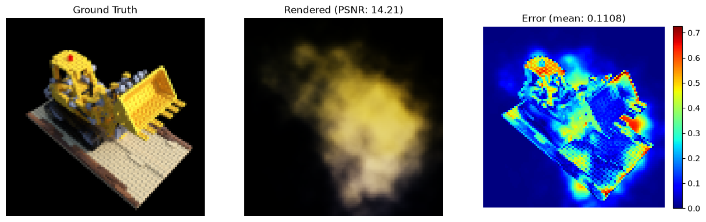
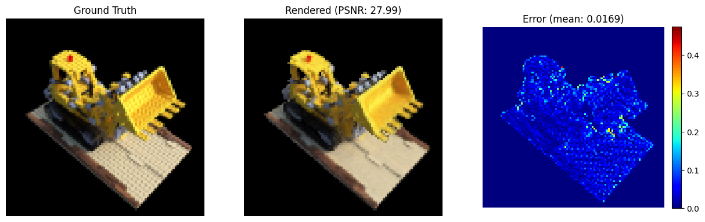
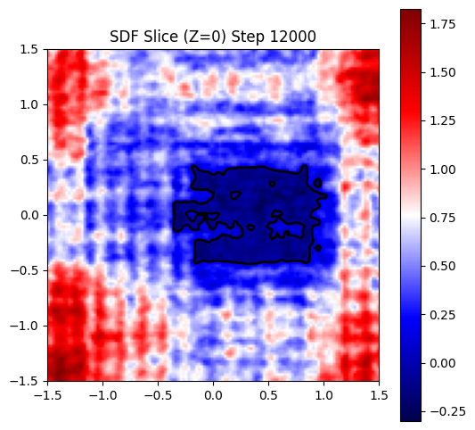
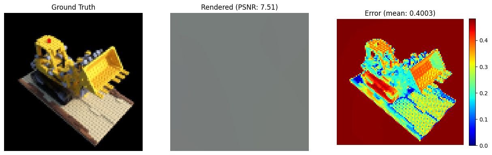
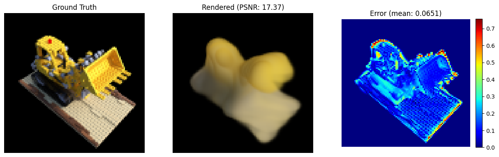
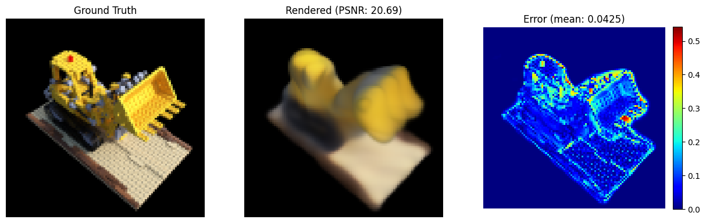
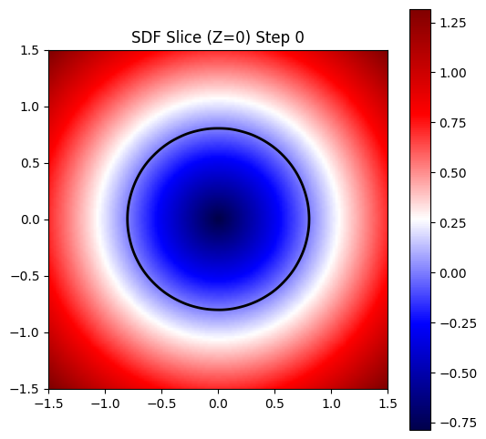

# SDF

本章主要用于记录SDF的nano手搓版本，用于对SDF有一个基本的认识。

# 环境依赖
```shell
conda create -n py312threeD python=3.12
conda activate py312threeD
pip install -r requirements.txt
```

# 使用介绍

###  数据下载
使用仅2D图片，预测d->sigma的方式进行训练，复用NeRF的训练集，放在公共路径下的`tiny_nerf_data.npz`。

### 模型训练
```shell
# shell脚本
bash train.sh

# python命令
python train.py \
    --init_radius 1.0 \
    --s_val_init 3.0 \
    --eikonal_weight 0.5 \
    --n_samples 128 \
    --n_iters 20000 \
    --display_int 500 \
    --exp_dir ./runs/demo01 \
    --device mps
```

### 模型推理

# 踩坑记录

### 渲染结果呈烟雾状
- 现象：iter=2000的时候渲染结果呈烟雾状，继续训练也并没有改进。
- 原因：距离到密度的转换函数有问题，同时采样点数不足
- 解决方案：参考volSFT和NeuS的alpha计算方式



### PSNR较高但边缘不清晰
- 现象：iter=12000的时候，PSNR达到28，但z=0的边界切片非常不规整。图片背景（红色区域）布满了明显的方块状纹理，像是在一张有格子的纸上画画。
- 原因：模型学会了去贴上颜色，但并没有真正学到几何结构。结合训练日志判断发现：
  - iter=12000的时候，Eikonal Loss仍维持在33-35，说明模型完全没有遵守SDF的基本物理原则。
  - s_val从5增加到了400，但在SDF场还没学好的情况下加锐化导致模型摆烂。
  - 还发现了代码在计算Eikonal Loss的时候没有做归一化的bug
- 解决方案：加大Eikonal Loss的权重，约束s_val的增长速度/将s改成可学习参数


<p align="center">
  
</p>

# 经验教训

### 归一化问题
经过了几轮训练的毒打，感觉还是得把归一化问题系统性的整理一下。大体步骤是：
1. 认为物体的中心在原点，相机分布在圆周。根据相机到远点距离的最大值进行归一化，将相机和物资整体缩放压入单位球中。
2. 设置near/far，分别表示采样时候从相机出发，沿镜头方向前进的距离。既然相机在单位球的球面上，物体在单位球内，默认相机方向指向3维原点的话，near/far应该设置为0.1/2.2。
2.2正好可以从一个在球壳上的相机朝原点走，穿过原点到达另一侧的球壳。
3. 设置radius，他代表的是我们认为物体/场景的初始半径是多少，这个我既然物体+相机都在单位球内，感觉设置为0.5-0.8都可以。
4. SDF network初始化的输出d应该是什么样？既然我们认为相机在球壳上，物体/场景是半径radius=0.8的球，d>0表示在物体外部，那么：
   - 对于离原点距离超过0.8的采样点，在初始化的物体外面，则d > 0
   - 对于离原点距离小于0.8的采样点，在初始化的物体里面，则d < 0
   - 通过控制初始化可以在network中加上距离先验知识
```python
def forward(self, x):

    x_embed = self.pos_enc(x)
    h = x_embed
    for i, l in enumerate(self.pts_linears):
        if i == 5:
            h = torch.cat([x_embed, h], dim=-1)
        h = F.softplus(l(h), beta=20)

    # 原始网络输出（初始≈0）
    sdf_raw = self.sdf_linear(h)

    # ---- 关键：加上球体距离先验 ----
    # ||x|| - init_radius，保持维度一致
    sdf = sdf_raw + torch.norm(x, dim=-1, keepdim=True) - self.init_radius

    features = self.feature_linear(h)
    return sdf, features
```
最终实现的效果是：
- 渲染上，随着训练可以看出从一个模糊的状态探索成一个“充气”感觉的挖掘机
- 切片上，初始的z=0的SDF切片是一个标准的圆形





<p align="center">
  
</p>

# debug关注点