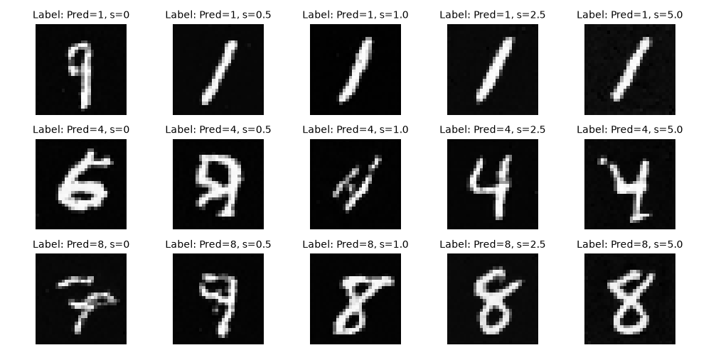

# Multimodal-Introduction

### [2026-06-13] 扩散模型（Nano版）

- 实现记录：[Nano-DDPM](https://github.com/flandy2010/Multimodal-Introduction/blob/main/diffusion_model/README.md)
- 训练数据：MNIST手写数据集
- 训练效果：

### [2026-06-14] 扩散模型&CFG（Nano版）

- 实现记录：[Nano-DDPM-CFG](https://github.com/flandy2010/Multimodal-Introduction/blob/main/diffusion_model_CFG/README.md)
- 训练数据：MNIST手写数据集
- 训练效果：

### [2026-06-14] Flow Match Model & CFG
- 实现记录：[Nano-Flow-Matching-CFG](https://github.com/flandy2010/Multimodal-Introduction/blob/main/flow_matching_model_CFG/README.md)
- 训练数据：MNIST手写数据集
- 训练效果：

