# Multimodal-Introduction

本仓库用于多模态模型的入门，模型和数据集都尽可能用Nano版本（除非真的拟合不了）。主要涉及内容为：
- 图像生成：生成范式涉及扩散模型、Flow Match Model，模型结构涉及UNet，Vision Transformer
- 3D生成：生成范式涉及NeRF、Instant-NGP、3DGS、SDF

# 通用数据集
- MINST手写数字：主要用于可控图片生成，同时也加入了部分变换内容后用于训练可控视频生成。
- tiny_nerf_data：用于训练NeRF、Instant-NGP、SDF
- 360_extra_scenes：用于训练3DGS

```shell
mkdir data && cd data

# 下载MINST手写数字数据集
cd 01_diffusion_model
python download_dataset.py

# 下载tiny_nerf_data
wget http://cseweb.ucsd.edu/~viscomp/projects/LF/papers/ECCV20/nerf/tiny_nerf_data.npz

# 下载360_extra_scenes
mkdir 360_extra_scenes
cd 360_extra_scenes
wget https://storage.googleapis.com/gresearch/refraw360/360_extra_scenes.zip
unzip 360_extra_scenes.zip
# python直接解压
# python -m zipfile -e 360_extra_scenes.zip ./

# 单独下载bonsai数据集
wget https://storage.googleapis.com/gresearch/refraw360/bonsai.zip
```

# 图像生成实验结果

### [2026-06-13] 扩散模型（Nano版）

- 实现记录：[Nano-DDPM](https://github.com/flandy2010/Multimodal-Introduction/blob/main/01_diffusion_model/README.md)
- 训练数据：MNIST手写数据集
- 训练效果：

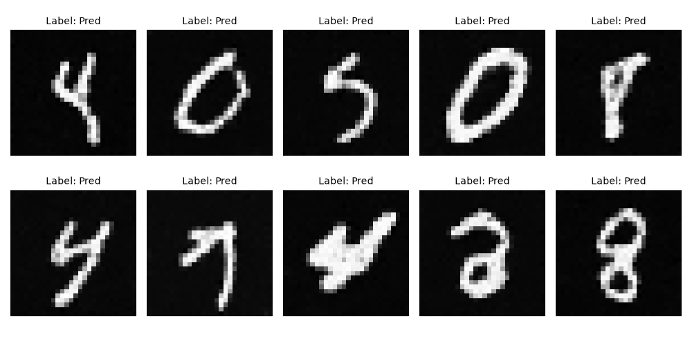

### [2026-06-14] 扩散模型 & CFG（Nano版）

- 实现记录：[Nano-DDPM-CFG](https://github.com/flandy2010/Multimodal-Introduction/blob/main/02_guided_diffusion_model/README.md)
- 训练数据：MNIST手写数据集
- 训练效果：

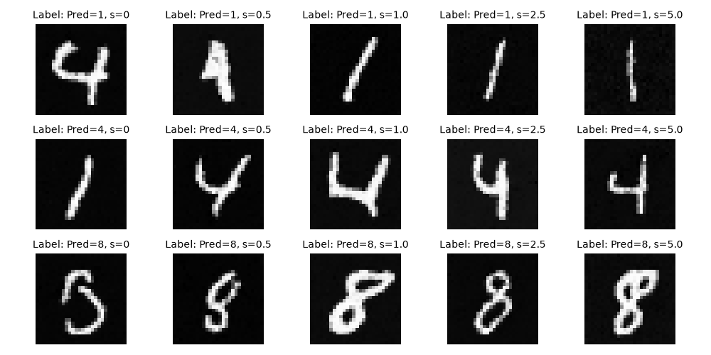

### [2026-06-14] Flow Match Model & CFG
- 实现记录：[Nano-Flow-Matching-CFG](https://github.com/flandy2010/Multimodal-Introduction/blob/main/03_guided_flow_matching/README.md)
- 训练数据：MNIST手写数据集
- 训练效果：


### [2026-06-15] DiT & CFG
基于Diffusion Transformer结构进行实验，带CFG但考虑到数据集分辨率较低暂时不使用VAE结构。
同时实现一个可以复用的训练框架，支持DiT，UNet等不同格式，支持DDPM和Flow Matching训练，
- 实现记录：[Nano-Flow-Matching-CFG](https://github.com/flandy2010/Multimodal-Introduction/blob/main/04_diffusion_transformer/README.md)
- 训练数据：MNIST手写数据集
- 训练效果：DiT + FlowMatching + sample_step=50

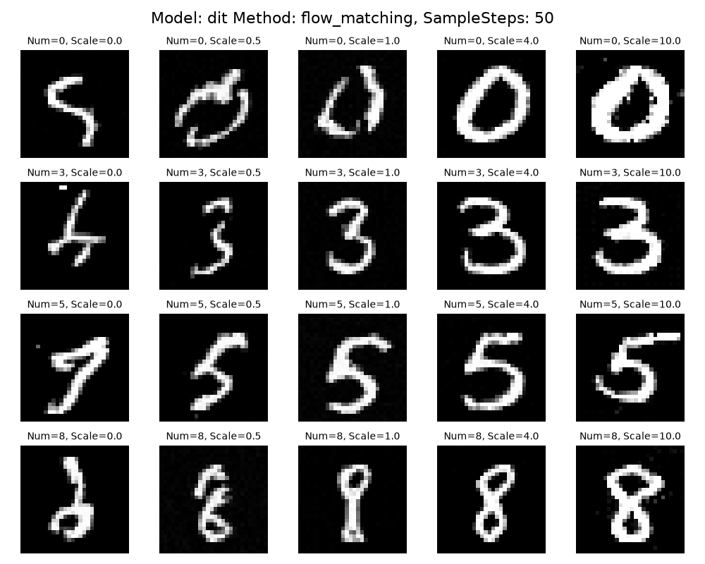

### [2026-06-19] Video Generation
基于Diffusion Transformer结构进行实验，带CFG但考虑到数据集分辨率较低暂时不使用VAE结构。使用工程化方案基于现有的图片进行视频生成：
- 实现记录：[Nano-Flow-Matching-CFG](https://github.com/flandy2010/Multimodal-Introduction/blob/main/05_video_generation/README.md)
  - 原始素材：MNIST手写数据集
  - 加工方式：图片缩放，图片翻转，图片旋转
  - 控制信息：通过模版方式生成如：“生成一张(数字1)(上下翻转)的视频片段”
- 训练效果：DiT + FlowMatching + sample_step=100 + n_frames=16
- 吐槽：本来想尝试时长3-5秒，分辨率28x28的视频生成。实际跑下来发现勉强能训的动16帧的生成

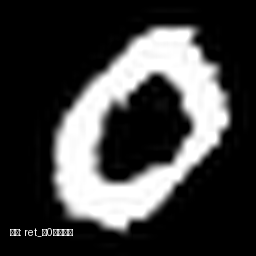
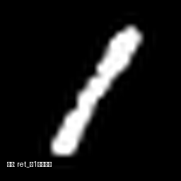
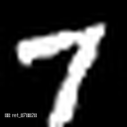
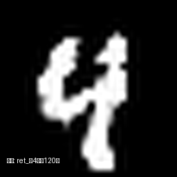

# 3D生成实验结果

### [TODO] Neural Radiance Fields
步入3D建模内容，先练习一下经典的神经辐射场（Neural Radiance Fields）。
- 实现记录：[Neural-Radiance-Fields](https://github.com/flandy2010/Multimodal-Introduction/blob/main/06_neural_radiance_fields/README.md)
- 训练数据：tiny_nerf_data
- 训练效果：n_samples=256 + iter=10000

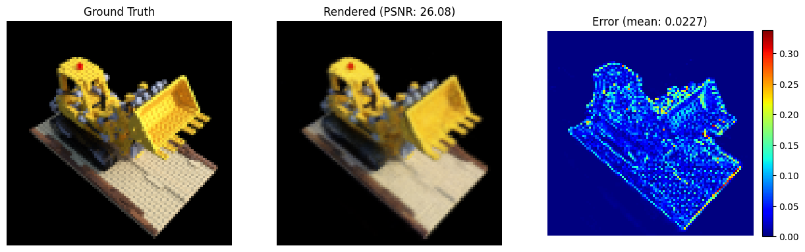

### [2026-06-22] Instant Neural Graphics Primitives
NeRF的改进版本，将`(x, y, z)`对应的特征内容从使用神经网络记忆变成查哈希表。仅使用神经网络对于特征进行处理，生成颜色和密度。
- 实现记录：[Instant-NGP](https://github.com/flandy2010/Multimodal-Introduction/blob/main/07_instant_neural_graphics_primitives/README.md)
- 训练数据：tiny_nerf_data
- 训练效果：n_samples=192 + iter=10000

<p align="center">
  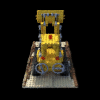
</p>


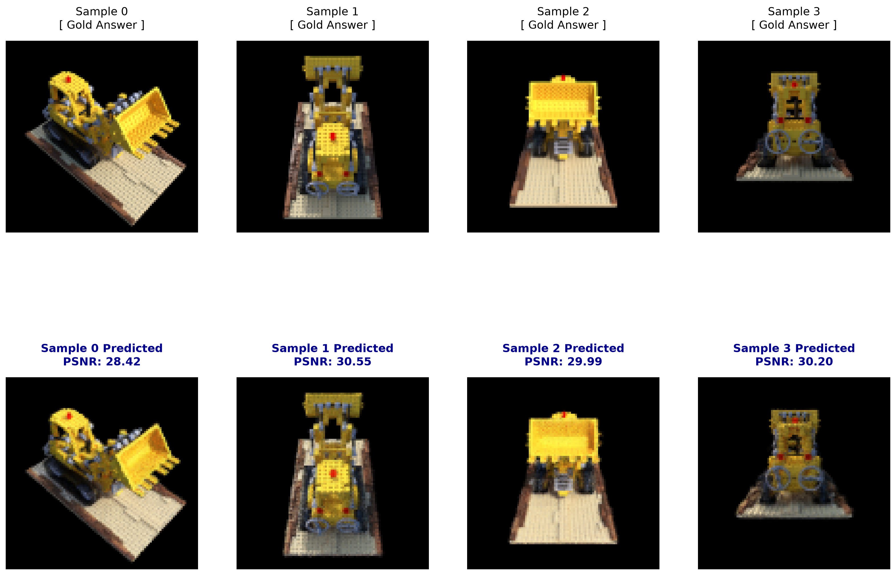


### [TODO] 3D Gaussian Splatting
主动生成版本，以粒子而非光线作为主体，让作为粒子的椭圆球体主动发光并投影到2D画布上，叠加后得到最终的颜色。
- 实现记录：[3DGS](https://github.com/flandy2010/Multimodal-Introduction/blob/main/08_3d_gaussian_splatting/README.md)
- 训练数据：bonsai，flower
- 训练效果：

### [2026-06-27] Signed Distance Field
Signed Distance Function，有符号距离函数存下一个数学函数。对于空间中任何一个点(x,y,z)，函数会返回一个数值d:
- d > 0: 点在物体外部，数值代表点到表面的最近距离。
- d < 0: 点在物体内部，数值代表点到表面的深度。
- d = 0: 点刚好在物体表面上。

SFD具有拓扑结构的自由度，完美的表面提取，无限的分辨率等优点。是从“视觉重建”走向“工业模型”最关键的桥梁。

- 实现记录：[SDF](https://github.com/flandy2010/Multimodal-Introduction/blob/main/09_signed_distance_field/README.md)
- 训练数据：tiny_nerf_data
- 训练效果：n_samples=128 + iter=100000 + volsdf(s_init=10.0)

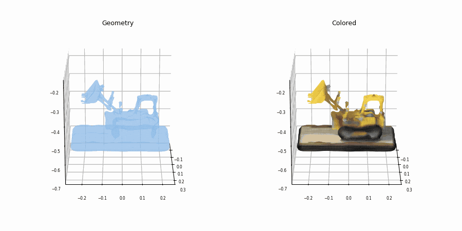